<p align="center">
  
</p>

<h3 align="center">
An AI-powered learning platform built for active recall, adaptive learning, and long-term retention.
</h3>

<p align="center">
  <a href="https://mentorai-prod.vercel.app/">Live Demo</a> •
  <a href="#features">Features</a> •
  <a href="#architecture">Architecture</a> •
  <a href="#screenshots">Screenshots</a> •
  <a href="#tech-stack">Tech Stack</a>
</p>

<p align="center">


</p>

---

# Live Demo

### Production Deployment

 https://mentorai-prod.vercel.app/

MentorAI is currently deployed as a live production MVP using:
- React + Vite frontend
- Express backend
- MongoDB Atlas
- AI provider abstraction
- local + cloud AI workflows

---

# What is MentorAI?

MentorAI is a full-stack AI learning platform designed around one core idea:

> Learning should optimize retention, not just content generation.

Most AI study tools focus heavily on summarization.  
MentorAI was built differently.

The platform combines:
- AI tutoring
- spaced repetition
- retrieval practice
- voice recall
- PDF ingestion
- adaptive flashcards
- quizzes
- knowledge graphs

into a unified learning workflow focused on improving long-term memory and active recall.

The goal was to create a system that feels less like:

> “ChatGPT for notes”

and more like:

> “an intelligent learning companion.”

---

# Features

## AI Tutor

A real-time AI tutor system powered by streaming responses and contextual learning workflows.

### Features
- Streaming tutor conversations using SSE
- Socratic-style tutoring
- Low-latency token streaming
- Context-aware explanations
- AI provider abstraction layer
- Adaptive learning workflows

---

## Smart Flashcards

MentorAI automatically transforms notes and study material into intelligent flashcards.

### Features
- AI-generated flashcards
- SM-2 spaced repetition scheduling
- Weak-topic prioritization
- Retention-focused review system
- Adaptive learning sessions

---

## PDF-to-Learning Pipeline

Upload PDFs and convert them into structured study content.

### Features
- PDF parsing
- AI-assisted extraction
- Automatic flashcard generation
- Structured note ingestion
- Intelligent study workflows

---

## Voice Recall System

Voice-based recall sessions powered by Whisper transcription.

### Features
- Speech-to-text workflows
- Whisper-based transcription
- Audio recall evaluation
- Voice learning sessions
- Lightweight FastAPI transcription service

---

## Knowledge Graph System

MentorAI internally connects:
- notes
- quizzes
- flashcards
- tutor sessions
- recall sessions

to create contextual learning relationships across the platform.

---

## Quiz & Analytics System

### Features
- AI-generated quizzes
- Quiz history tracking
- Performance analytics
- Retention insights
- Weak-topic analysis

---

# Why I Built This

While studying, I noticed most AI tools were great at:
- generating summaries
- rewriting notes
- answering questions

but terrible at:
- improving retention
- strengthening recall
- adaptive review scheduling
- long-term learning

I wanted to build something that combines:
- AI assistance
- active recall
- spaced repetition
- retrieval practice
- conversational learning

into a system that genuinely helps people learn better over time.

MentorAI started as an experiment around AI-assisted studying and eventually evolved into a full-stack learning platform with modular AI infrastructure and adaptive learning workflows.

---

# Architecture

## High-Level System Flow

<p align="center">
  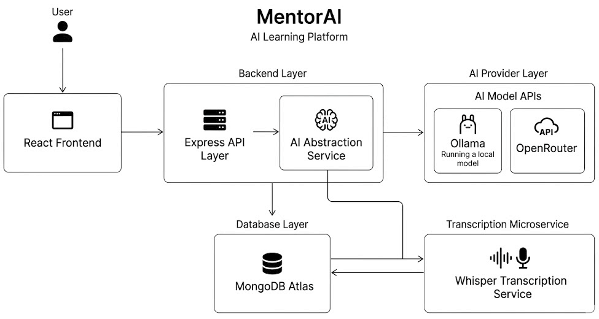
</p>

---

## AI Tutor Streaming Pipeline

<p align="center">
  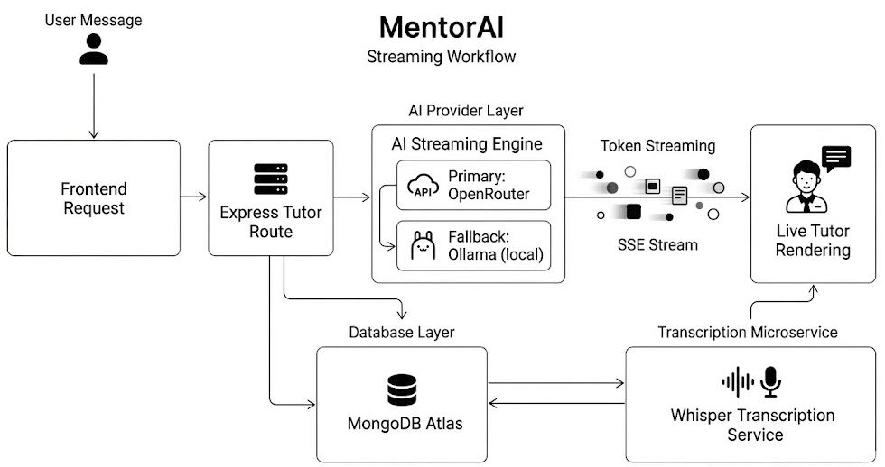
</p>

---

## Voice Recall Pipeline

<p align="center">
  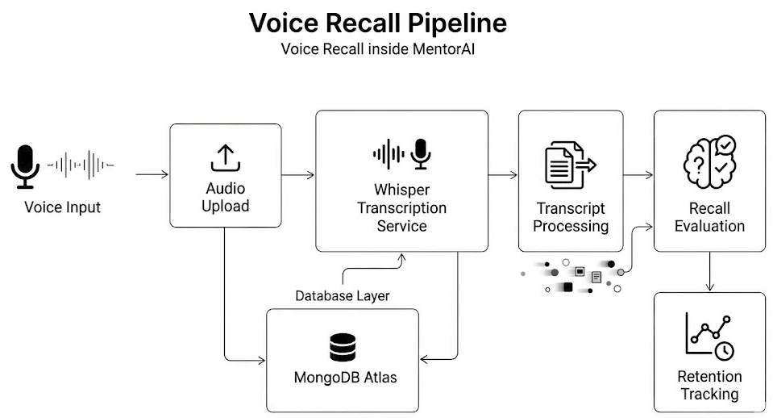
</p>

---

## PDF Ingestion Pipeline

<p align="center">
  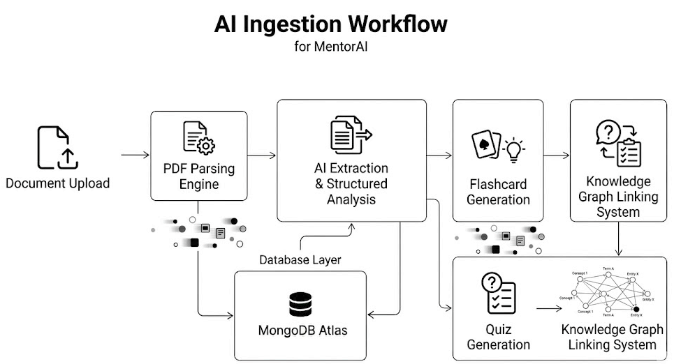
</p>

---

# Key Engineering Highlights

- Built a real-time SSE streaming AI tutor system
- Implemented adaptive SM-2 spaced repetition scheduling
- Designed modular AI provider abstraction supporting Ollama + OpenRouter
- Built a FastAPI-based Whisper transcription microservice
- Implemented AI rate limiting and usage gating
- Developed PDF ingestion and AI extraction workflows
- Designed modular backend services for scalability and maintainability

---

# Tech Stack

## Frontend
- React 19
- TypeScript
- Vite
- Tailwind CSS
- Framer Motion
- Zustand

---

## Backend
- Node.js
- Express.js
- MongoDB
- Mongoose
- Zod Validation

---

## AI & Automation
- OpenRouter
- Ollama
- OpenAI Whisper
- SSE Streaming
- SM-2 Algorithm

---

## Infrastructure
- Vercel
- MongoDB Atlas
- Render
- FastAPI
- JWT Authentication

---

# Repository Structure

```bash
MentorAI/
│
├── client/
│   ├── src/
│   │   ├── components/
│   │   ├── pages/
│   │   ├── store/
│   │   ├── hooks/
│   │   └── utils/
│
├── server/
│   ├── routes/
│   ├── middleware/
│   ├── services/
│   ├── models/
│   ├── controllers/
│   └── utils/
│
├── whisper-server/
│
│
└── README.md
```

---

# Screenshots

## Dashboard

<p align="center">
  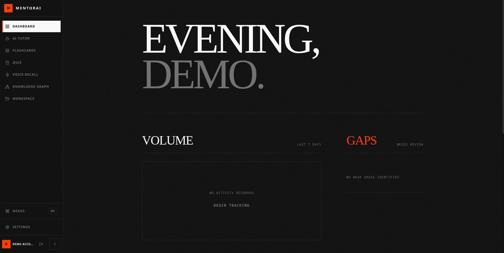
</p>

---

## AI Tutor Interface

<p align="center">
  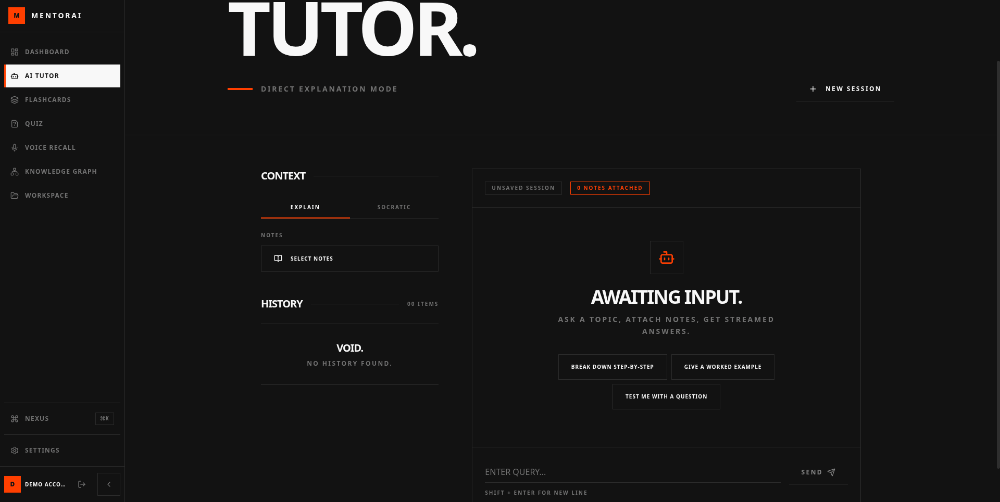
</p>

---

## Flashcard Review System

<p align="center">
  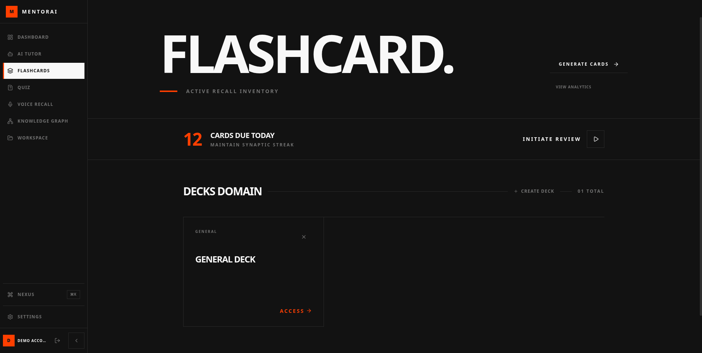
</p>

---

## Voice Recall Workflow

<p align="center">
  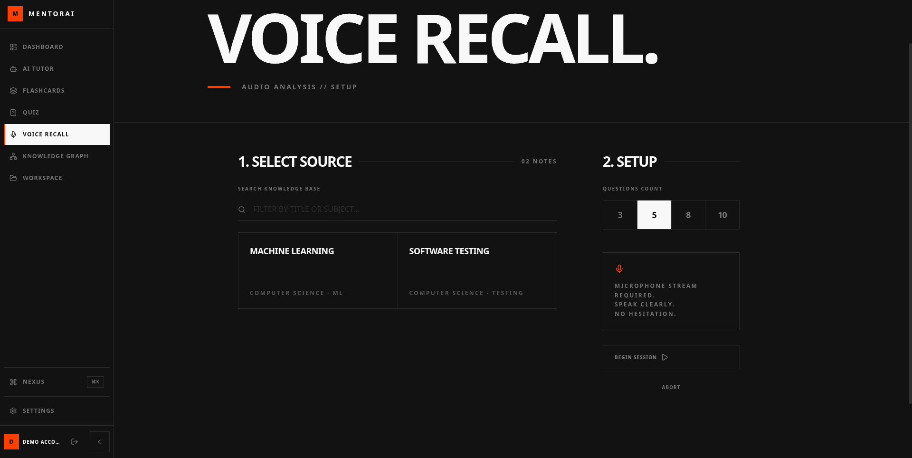
</p>

---

## Knowledge Graph

<p align="center">
  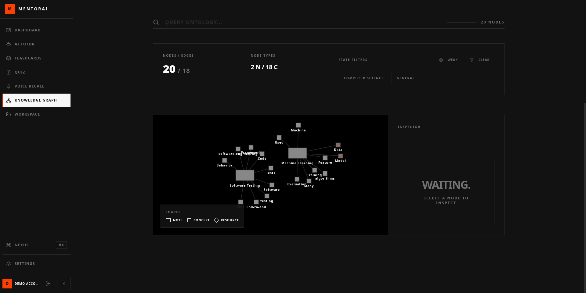
</p>

---

## Quiz System

<p align="center">
  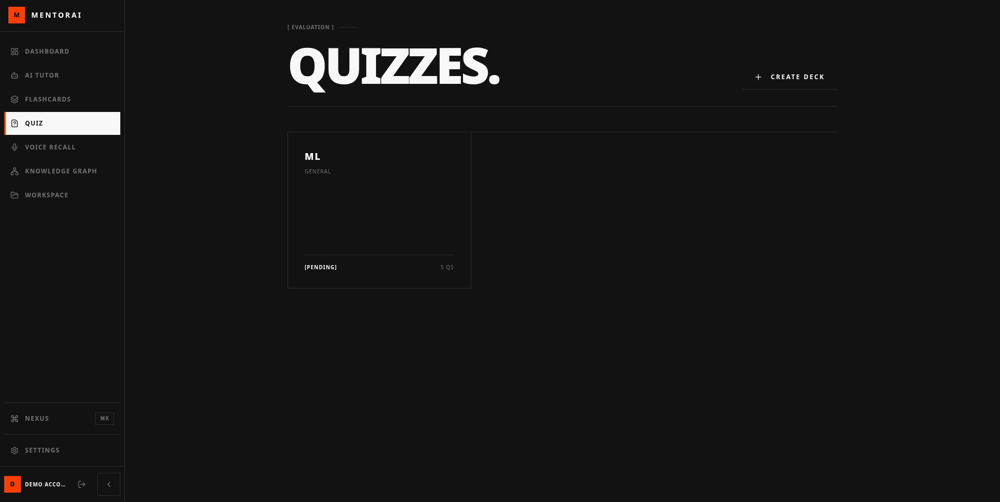
</p>

---

## Workspace

<p align="center">
  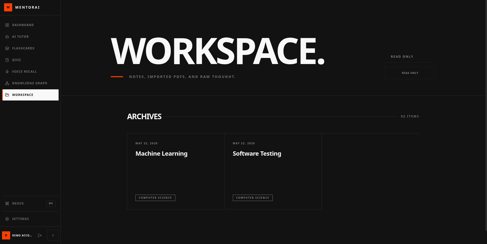
</p>

---

# Engineering Challenges

## Real-Time AI Streaming

One of the biggest challenges was maintaining stable streaming tutor responses while handling:
- long AI outputs
- provider inconsistencies
- malformed token streams
- unreliable response formatting

To solve this, MentorAI uses:
- Server-Sent Events (SSE)
- centralized AI abstraction
- resilient stream handling
- fallback parsing strategies

---

## Multi-Provider AI Infrastructure

The platform supports:
- local models through Ollama
- production inference through OpenRouter

while keeping a unified AI request layer internally.

This made it possible to:
- reduce local development costs
- improve production reliability
- keep AI workflows modular

---

## Voice Recall Infrastructure

The voice recall system required building a lightweight transcription pipeline using:
- FastAPI
- Whisper
- ffmpeg
- asynchronous processing

while keeping latency low enough for interactive recall sessions.

---

## Adaptive Learning Logic

Implementing spaced repetition scheduling required deterministic review behavior across sessions and devices while maintaining adaptive learning workflows.

The scheduling system is inspired by the SM-2 algorithm and prioritizes:
- weak topics
- overdue cards
- recall difficulty
- long-term retention

---

# Future Improvements

- Multi-agent tutor workflows
- Dockerized deployment
- Real-time collaborative study rooms
- Better analytics and retention insights
- Local vector database integration
- AI memory systems
- Plugin architecture
- Mobile application support

---

# Project Status

> Active Development

MentorAI is actively evolving with ongoing improvements across:
- AI tutoring
- adaptive learning
- voice recall
- retrieval workflows
- backend scalability
- AI infrastructure

---

# Author

## Ehaan Dadarkar

- Portfolio: https://ed-port.vercel.app
- LinkedIn: https://linkedin.com/in/ehaan-dadarkar-1694a8351
- GitHub: https://github.com/Ehaan-Dadarkar